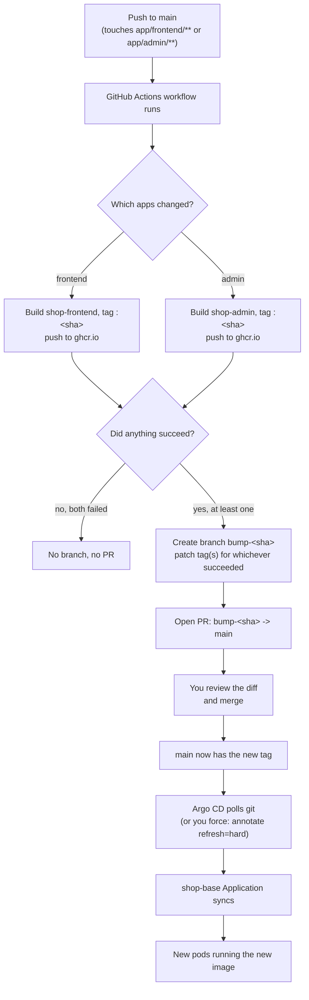
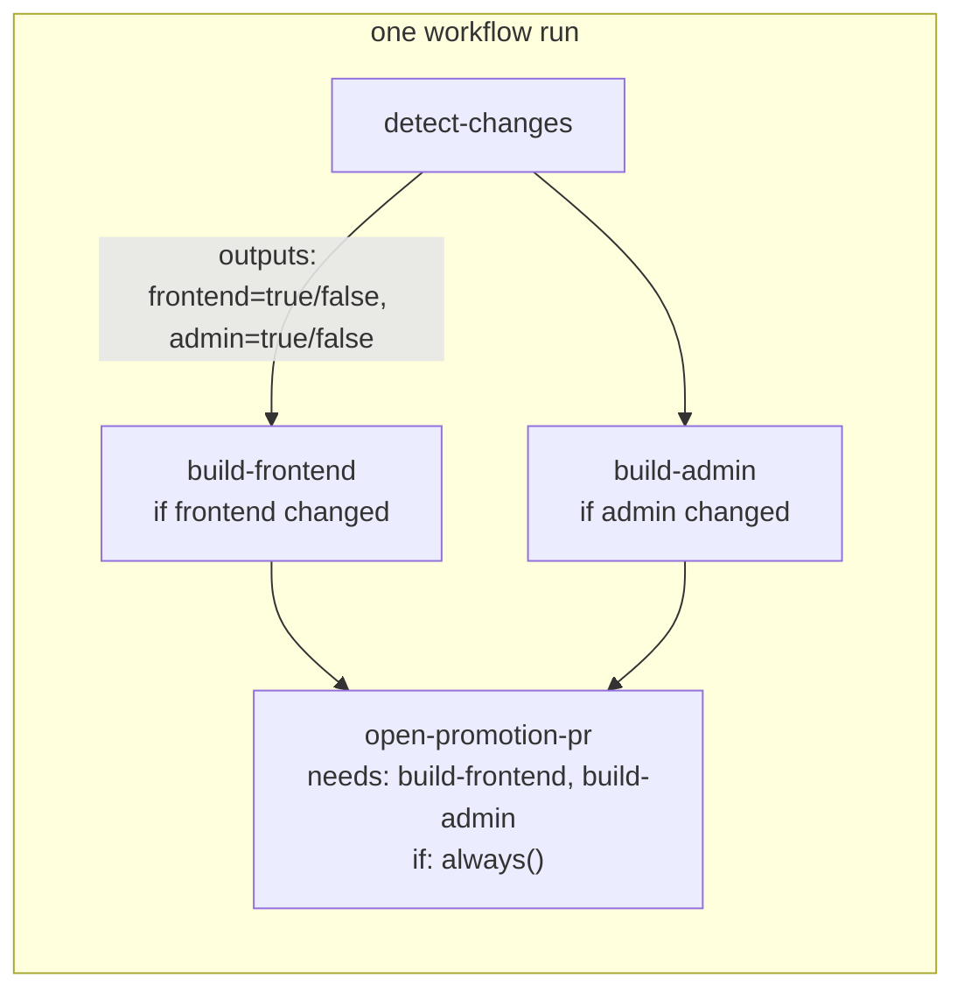

# CI/CD: build, promote, deploy

How an app code change gets from a commit to a running pod, and the GitHub
Actions concepts behind each step. Pairs with [`docs/lessons.md`](lessons.md)
(the Kubernetes side) and the [GitOps with Argo CD](../README.md#gitops-with-argo-cd)
section of the main README (the deploy side).

## End-to-end flow

**Why a PR instead of a direct commit:** the CI job never has authority to change
what's actually running — it only proposes a change. Argo CD only reacts to
what's on `main`, so merging the PR *is* the deploy trigger. This also keeps
`main` protected and gives you a diff to review (old tag → new tag) before
anything reaches the cluster.

**Why one branch/PR per commit, not per app:** a single commit can touch both
`app/frontend` and `app/admin` (e.g. a breaking change between them). Bundling
both tag bumps into one branch/PR means you review and merge them as one
atomic unit, instead of two PRs that could be merged out of order and leave
the cluster half-updated.

**Why partial promotion, not all-or-nothing:** the alternative — refuse to
open any PR unless every triggered build succeeds — sounds safer but creates
a worse bug: a successful build's image sits in `ghcr.io` tagged and ready,
but never referenced by any PR. If the next commit only fixes the *other*
app, its diff never touches the first app's files, so nothing notices the
first image is still waiting — it's orphaned indefinitely. Promoting whatever
succeeded, immediately, avoids that by construction: nothing is ever left
waiting on an unrelated future commit to rediscover it. The cost is that a
commit needing frontend and admin to move together can produce two PRs
instead of one atomic PR — acceptable here since you're the sole reviewer and
can just hold off merging one until its counterpart shows up.

## Inside the workflow (GitHub Actions job graph)

`detect-changes` is one job; `build-frontend` and `build-admin` are separate
jobs that only run if their app's files changed. `open-promotion-pr` runs with
`if: always()` — so it still runs even if a build job failed or was skipped —
then checks each build job's own result and only bumps the tag(s) for the
ones that actually succeeded. If neither succeeded, it exits without creating
a branch or PR.

## GitHub Actions concepts you'll meet in the workflow file

| Concept | What it means here |
| --- | --- |
| **Trigger (`on:`)** | `push` to `main`, filtered with `paths:` to `app/frontend/**` / `app/admin/**` so unrelated changes (docs, k8s manifests, argocd config) never build an image. |
| **Job** | An independent unit of work that runs on its own fresh runner VM. `detect-changes`, `build-frontend`, `build-admin`, `open-promotion-pr` are four separate jobs in one workflow. |
| **`needs:`** | Declares a job depends on another finishing first. `open-promotion-pr` needs the build jobs, so it always runs *after* them, not in parallel. |
| **Job outputs** | How jobs pass data to each other (jobs don't share memory/filesystem). `detect-changes` outputs `frontend: 'true'/'false'` and `admin: 'true'/'false'`; the build jobs read those via `if: needs.detect-changes.outputs.frontend == 'true'`. |
| **Skipped vs. failed, and `if: always()`** | A job's default `if: success()` means it's skipped if *any* needed job failed *or was skipped*. Since we want `open-promotion-pr` to run even when a build failed or didn't run at all, it uses `if: always()` to opt out of that default, then reads `needs.build-frontend.result` / `needs.build-admin.result` itself to decide what to include (`'success'` → bump it, anything else → leave it out). |
| **`permissions:`** | Each workflow declares the minimum access its `GITHUB_TOKEN` gets: `contents: write` (push the branch/commit), `pull-requests: write` (open the PR), `packages: write` (push to ghcr.io). Repo default is read-only ([checked earlier](../README.md)); this block overrides it for just this workflow. |
| **`GITHUB_TOKEN`** | Auto-issued per run, expires when the job ends, never stored as a secret you manage. Used to log in to `ghcr.io` and to open the PR — no custom secret needed. |
| **Marketplace actions** | Reusable steps published by others: `actions/checkout` (clone the repo), `dorny/paths-filter` (the `detect-changes` logic), `docker/login-action` + `docker/build-push-action` (build/push to ghcr.io), `peter-evans/create-pull-request` (branch + commit + PR in one step). |
| **Runner** | The disposable VM each job executes on (`ubuntu-latest`). It has internet access (can reach ghcr.io) but *not* your minikube cluster — hence the PR hand-off instead of a direct deploy. |

## Image naming and tags

Images are pushed to `ghcr.io/sajin-varghese1990/shop-frontend` and
`ghcr.io/sajin-varghese1990/shop-admin`, tagged with the **app commit SHA**
that triggered the build (not a version string) — so the tag, the PR, and the
exact source code are always traceable to each other.

## Local build path still works

`scripts/app-up.sh` (local `docker build` + `minikube image load`) is
unchanged and still the fastest inner loop for iterating without pushing.
This pipeline is the path for changes you intend to actually promote through
`main` and Argo CD.
